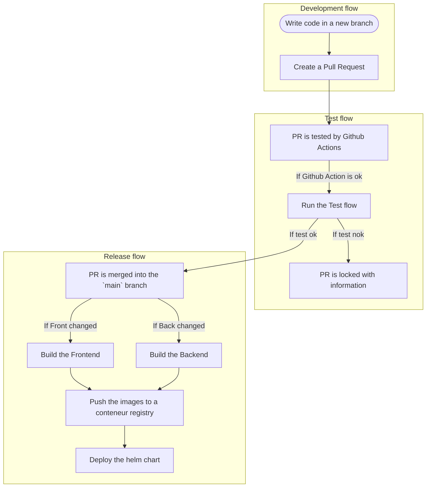

# Monofolio CICD

## Goal

- Create a "beta" version of the Monofolio website that is automatically deployed and is a ref to the `main` branch of the repository.
- Create a "production" version of the Monofolio website that is automatically deployed and is a ref to a `tag` in the repository.
- Make sure that the "production" version is tested in depth

### Deploy flow

- Build the Frontend if the folder related to the Frontend has changed.
  - apps/front
  - libs/front/*
- Build the Backend if the folder related to the Backend has changed.
  - apps/back
  - libs/back/*
- Push the images to a conteneur registry.
- Deploy the images to a Kubernetes cluster.

### Test flow

- Run Code Coverage tests on the Backend
- Run E2E tests on the Frontend
- Run Lighthouse tests on the Frontend
- Run Security tests on both the Backend and the Frontend

### Deployment flow

- Write code in a new branch
- Create a Pull Request
- PR is tested by Github Actions then the Test flow is executed.
- If both the Test flow and the PR checks pass, the PR is merged into the `main` branch.
- The Release flow is executed and the `beta` version is deployed.
- If the `beta` version is stable, a new tag is created and the `production` version is deployed.

