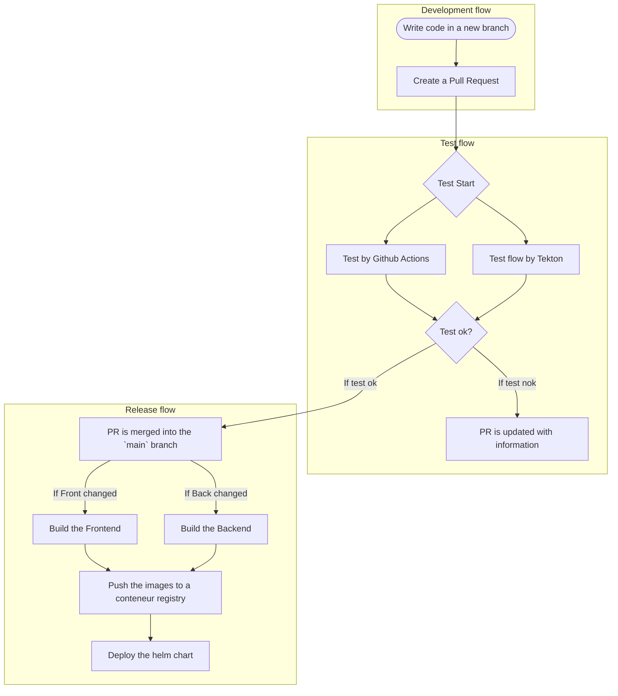

## Goal

- Create a "beta" version of the Monofolio website that is automatically deployed and is a ref to the `main` branch of the repository.
- Create a "production" version of the Monofolio website that is automatically deployed and is a ref to a `tag` in the repository. And Link to a Release Note with Changelog.
- Make sure that the "production" version is tested in depth

### Deploy flow

- Build the Frontend if the folder related to the Frontend has changed.
  - apps/front
  - libs/front/*
- Build the Backend if the folder related to the Backend has changed.
  - apps/back
  - libs/back/*
  - folio_content
- Push the images to a conteneur registry.
- Deploy the images to a Kubernetes cluster.

### Test flow

- Run Code Coverage tests on the Backend
- Run E2E tests on the Frontend
- Run Lighthouse tests on the Frontend/backend <https://github.com/jenkins-x/lighthouse/blob/main/docs/install_lighthouse_with_tekton.md>
- Run Security tests on both the Backend and the Frontend

### Deployment flow

- Write code in a new branch
- Create a Pull Request
- PR is tested by Github Actions then the Test flow is executed.
- If both the Test flow and the PR checks pass, the PR is merged into the `main` branch.
- The Release flow is executed and the `beta` version is deployed.
- If the `beta` version is stable, a new tag is created and the `production` version is deployed.

#### Test

test 12345

## Tasks

- [x] Update Github with pipeline status <https://hub.tekton.dev/tekton/task/github-set-status>
- [ ] Generate a Software Bill of Materials (SBOM) <https://hub.tekton.dev/tekton/task/syft>
- [ ] Analyze the SBOM for vulnerabilities <https://hub.tekton.dev/tekton/task/grype>
- [ ] Send a notification to discord <https://hub.tekton.dev/tekton/task/send-to-webhook-discord>
  - When a PR pass the test flow
  - When a PR is merged
  - When a new version is deployed (beta or production)
  - When a vulnerability is found (don't know if it's possible to send the vulnerability from github to discord)
- [x] Create a Helm chart for the backend/frontend
- [x] Build the Frontend/Backend
- [ ] Check if the Frontend/Backend helm chart is Okay <https://hub.tekton.dev/tekton/task/pluto>
- [ ] Check secret <https://hub.tekton.dev/tekton/task/kube-linter>

## Github Events to listen

- [ ] Pull Request "opened, synchronized"
- [x] Push on the `main` branch
- [ ] Tag created
