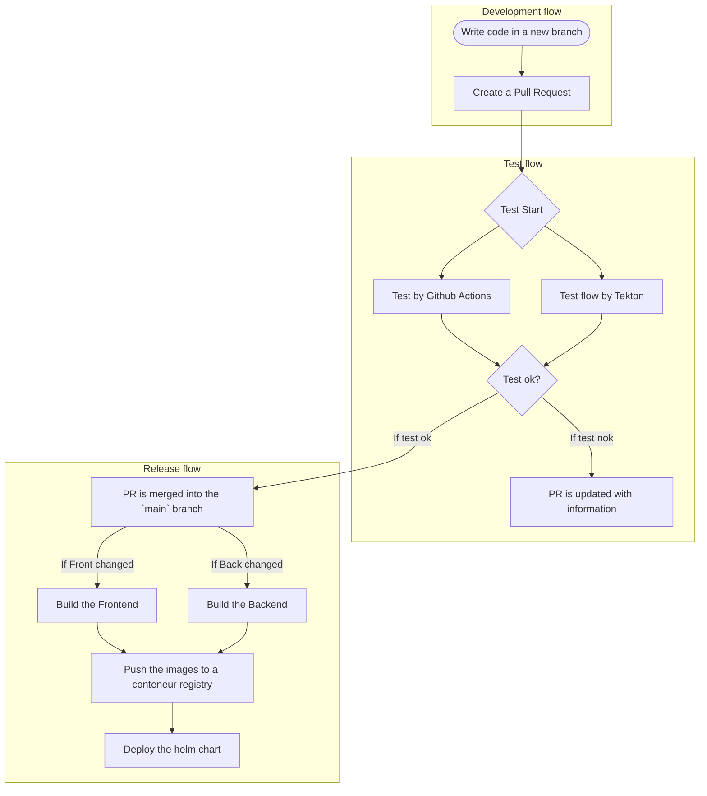

Quick description of the techno used in the different projects.



```javascript
console.log('Hello, World!');
```

```bash
echo "Hello, World!"
```

```yaml
apiVersion: v1
kind: Pod
metadata:
  name: my-pod
spec:
  containers:
  - name: my-container
    image: nginx
```

```rust
fn main() {
    println!("Hello, World!");
}
```
